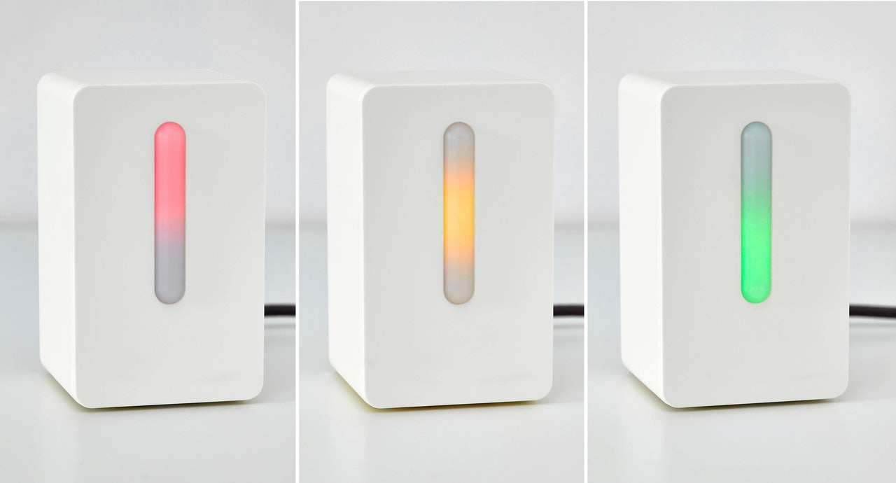

[](http://badges.mit-license.org)

# Ikea VINDRIKTNING sensor app



The project is under development and proposes an IoT integration over a cheap air quality sensor named [VINDRIKTNING](https://www.ikea.com/it/it/p/vindriktning-sensore-della-qualita-dellaria-80515910/), sold by Ikea. The idea is inspired by the [following](https://github.com/Hypfer/esp8266-vindriktning-particle-sensor) project, developed by Hypfer.

## How it works

### Customize and configure your vindriktning units

You'll have to flash the custom firmware on each unit, then power it up and connect to each sensor (exposed as Soft Access Point) in order to configure WiFi and MQTT parameters.

### Generate certificates

First, cd to the `proxy` directory by running

```bash
cd proxy
```

Then, edit the `gen-certs` script with your `alt_names` entries and edit the `default.conf` in order to set a `server_name` that matches your current domain. After that, you can run the script.

```bash
./gen-certs
```

### Assign variables

Create a `.env` file in the root directory of the repository and compile it according to the following template: 

```bash
MOSQUITTO_USERNAME=your-mosquitto-username
MOSQUITTO_PASSWORD=your-mosquitto-password
INFLUXDB_ADMIN_USER=your-influxdb-admin-user
INFLUXDB_ADMIN_PASSWORD=your-influxdb-admin-password
INFLUXDB_API_USER=your-influxdb-api-user
INFLUXDB_API_PASSWORD=your-influxdb-api-password
TELEGRAM_BOT_TOKEN=your-telegram-bot-token
AUTH_USERNAME=monitortool-username
AUTH_USERPASS=monitortool-password
JWT_SECRET_KEY=api-jwt-secret
API_SECRET_KEY=api-secret
```

### Build and run

Locate in the root directory of the repository and run

```bash
docker-compose build
```

Then, you just have to run

```bash
docker-compose up
```

If your sensors are configured properly they should connect to the MQTT broker in a few seconds, then data logging will start.

You will be able to access the monitortool by navigating to the previously configured domain. If you used the `gen-certs` script you may have to mark the certificate as valid too. 

You can access the monitortool with the username and password you provided in the `.env` file.
